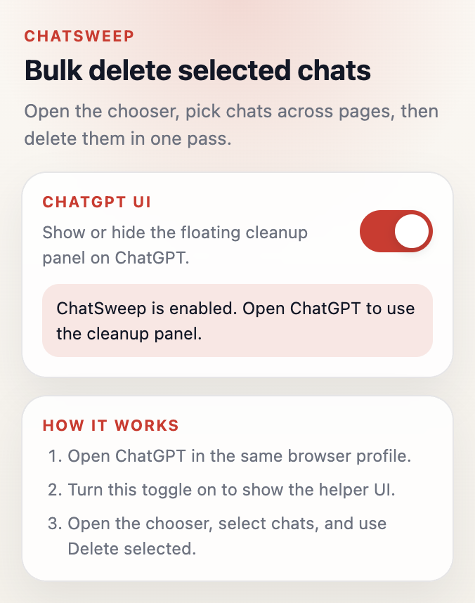
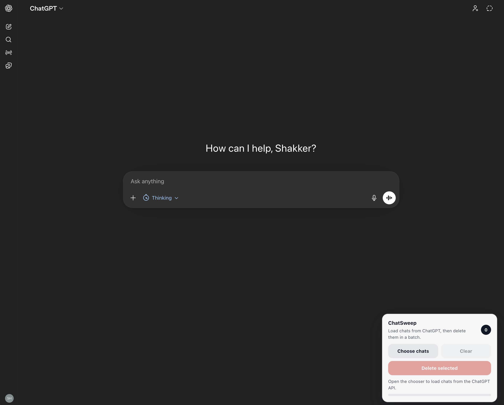

# ChatSweep

Selective bulk cleanup for ChatGPT chats.

`ChatSweep` is a small Chrome extension that helps you review and hide specific ChatGPT conversations without using ChatGPT's global "delete all" setting.

This is an unofficial project and is not affiliated with or endorsed by OpenAI.



## Features

- API-backed chat chooser modal
- Pagination across your chat history
- Selection that persists across modal pages in the current session
- Bulk cleanup workflow triggered from one place
- Local-only behavior with no external service

## How It Works

`ChatSweep` runs inside your logged-in ChatGPT tab.
It loads conversations from ChatGPT's own backend endpoints and sends the same kind of conversation visibility updates that ChatGPT itself uses.

There is no separate sign-in flow, no stored credentials, and no remote backend for this project.

## Screenshots



## Install Locally

1. Open `chrome://extensions`
2. Turn on **Developer mode**
3. Click **Load unpacked**
4. Select this project folder
5. Pin the extension if you want easy access to the popup toggle
6. Open the extension popup and confirm the ChatSweep toggle is enabled
7. Refresh your ChatGPT tab once

## Usage

1. Open ChatGPT in the same browser profile where the extension is installed
2. Click the `ChatSweep` toolbar icon and confirm the UI is enabled
3. Use the floating `ChatSweep` panel on ChatGPT
4. Click `Choose chats`
5. Select chats across one or more pages
6. Click `Delete selected`

## Privacy

- `ChatSweep` does not send your data to any server controlled by this project
- `ChatSweep` does not include analytics or tracking
- `ChatSweep` stores only a simple enabled or disabled preference in `chrome.storage.local`

See [PRIVACY.md](PRIVACY.md) for a dedicated privacy statement.

## Project Structure

- `manifest.json`: Chrome extension manifest
- `assets/`: README screenshots
- `assets/icons/`: Extension icon assets and source artwork
- `src/content.js`: API-backed chooser modal and delete flow
- `src/page-bridge.js`: Page-context bridge for ChatGPT request behavior
- `src/content.css`: Floating panel and modal styling
- `src/popup.html`: Popup shell
- `src/popup.css`: Popup styling
- `src/popup.js`: Popup enable or disable toggle

## Caveats

- ChatGPT only for now
- No search or advanced filtering yet
- Uses ChatGPT's internal visibility API rather than an official public API
- Depends on ChatGPT's current internal API shape
- May need updates if ChatGPT changes request headers, payloads, or endpoint behavior

## Development

There is no build step right now.
Load the extension unpacked in Chrome and reload it after local changes.

Useful checks:

```bash
node --check src/content.js
node --check src/page-bridge.js
node --check src/popup.js
```

## Roadmap

- Search inside the chooser modal
- Better filters like date ranges or pinned state
- Support for more chat providers
- Cleaner publish workflow for the Chrome Web Store

## License

MIT. See [LICENSE](LICENSE).
